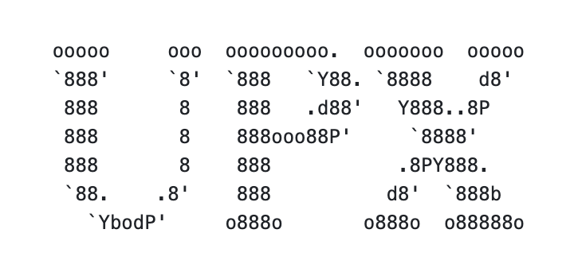

<h1 style="text-align:center">awesome-modern-compiler</h1>

  

 **🌐 About This Site**

This website is a curated learning portal for compiler enthusiasts and systems programmers. It offers tutorials, academic resources, expert profiles, project showcases, and interactive tools — all centered around LLVM, GCC, and modern compilation technologies.

> [简体中文版](README.zh.md)

**🚀 Live Demo**

You can explore the live version of this site at: https://yilingqinghan.github.io/awesome-modern-compiler/

> 🪵Still Under Construction!

## Learning Path Reference

## Courses and Foundational Knowledge

- [LLVM Tutorial](https://llvm.org/docs/tutorial/) – A beginner-friendly tutorial for LLVM development
- [Stanford-CS143-Compilers](https://web.stanford.edu/class/cs143/) - A compiler for the COOL language that generates MIPS assembly and runs on a simulator, using <b>Compilers: Principles, Techniques, and Tools</b> as the textbook.
- [Peking University: Compiler Principles Practice](https://pku-minic.github.io/online-doc/#/) – A SysY-to-RISC-V compiler built on Koopa IR (an LLVM-like IR), accompanied by an open-source tutorial, toolchain, and experimental environment.
- [USTC: Principles and Techniques of Compiler](https://ustc-compiler-principles.github.io/2023/) – Six hands-on labs covering a full compiler pipeline, with backend code generating Loongson assembly.
- [Machine Learning Systems: Design and Implementation Online Tutorial](https://openmlsys.github.io/index.html) – The world’s first comprehensive open-source book on machine learning systems.
- [ChinaSys Academic Open-Source Innovation Platform](https://chinasys.org/opensource/index.html) – An open platform for filtering research papers by domain, keywords, title, or author.
- [ML-Engineering](https://stasosphere.com/machine-learning/) - Machine Learning Engineering Open Book

## Hands-on Practice

- [LLVM Tutorial](https://llvm.org/docs/tutorial/) – A beginner-friendly tutorial for LLVM development

## Renowned Researchers and Teams

- [Xavier Leroy](https://github.com/xavierleroy) – Coq, OCaml, CompCert
- [Chris Lattner](https://en.wikipedia.org/wiki/Chris_Lattner) – LLVM, Swift, MLIR, CRICT, Modular
- [Michael O’Boyle](https://en.wikipedia.org/wiki/Michael_O%27Boyle) – ML, Adaptive Compilation, MilePost GCC

## Open Source Git Repositories

### Compilers

- [LLVM](https://github.com/llvm/llvm-project) <!---->
- [GCC](https://gcc.gnu.org/) <!---->
- [CompCert](https://github.com/AbsInt/CompCert) <!---->
- [GraalVM](https://github.com/oracle/graal) <!---->

- [moonbit](https://github.com/moonbitlang/core) <!---->

- [V8](https://github.com/v8/v8) <!---->

- [wasmtime](https://github.com/bytecodealliance/wasmtime) <!---->

- [TinyCC](https://github.com/TinyCC/tinycc) <!---->

### AI Compilation Frameworks

- [TVM](https://github.com/apache/tvm) <!---->

- [CIRCT](https://github.com/llvm/circt) <!---->

- [XLA](https://github.com/openxla/xla) <!---->

- [Triton](https://github.com/triton-lang/triton) <!---->

- [Glow](https://github.com/pytorch/glow) <!---->

### Tools

- [Mold](https://github.com/rui314/mold) <!---->

- [Alive2](https://github.com/AliveToolkit/alive2) <!---->

- [llvm-flow](https://github.com/kc-ml2/llvm-flow) <!---->

- [upx](https://github.com/upx/upx) <!---->

### Programming Languages

- [Rust](https://github.com/rust-lang/rust) <!---->

- [Swift](https://github.com/swiftlang/swift) <!---->

- [Go](https://github.com/golang/go) <!---->

- [Zig](https://github.com/ziglang/zig) <!---->

- [Nim](https://github.com/nim-lang/Nim) <!---->

- [Julia](https://github.com/JuliaLang/julia) <!----> 

- [Crystal](https://github.com/crystal-lang/crystal) <!----> 

## Influential Papers and Surveys

- [CGO](http://dl.acm.org/doi/10.5555/977395.977673) – LLVM: A Compilation Framework for Lifelong Program Analysis & Transformation

## Online Interactive Tools

- [Compiler Explorer](https://godbolt.org/) – An open-source web-based tool that shows compiled assembly in real-time; useful for learning, debugging, and optimization comparison

## Performance Analysis and Debugging

- [GDB](https://www.gnu.org/software/gdb/) – The most widely used general-purpose debugger

## Community and Discussions

- [LLVM Discord](https://discord.com/invite/xS7Z362) – The official LLVM community chat space for real-time discussions on compilers, toolchains, and contributing

## Glossary

- [AOT](https://en.wikipedia.org/wiki/Ahead-of-time_compilation)

## Emerging Trends

- See Our Website Directly

## Video Tutorials and Lectures

- [LLVM Tutorial](https://llvm.org/docs/tutorial/) – A beginner-friendly tutorial for LLVM development

## Conferences, Journals, and Workshops

### Conferences

- [CGO](https://dl.acm.org/conference/cgo) `CORE A` `CCF B`
- [PLDI](https://dl.acm.org/conference/pldi) `CORE A*` `CCF A`
- [ASPLOS](https://dl.acm.org/conference/asplos) `CORE A*` `CCF A`
- [CC](https://dl.acm.org/conference/cc) `CORE B*`
- [PPoPP](https://dl.acm.org/conference/ppopp) `CORE B` `CCF A`
- [MICRO](https://dl.acm.org/conference/micro) `CORE TBR` `CCF A`
- [ISCA](https://dl.acm.org/conference/isca) `CORE A*` `CCF A`
- [EuroSys](https://dl.acm.org/conference/eurosys) `CORE A` `CCF A`
- [PACT](https://dl.acm.org/conference/pact) `CORE B` `CCF B`
- [ICS](https://dl.acm.org/conference/ics) `CORE A` `CCF B`
- [POPL](https://dl.acm.org/conference/popl) `CORE A*` `CCF A`
- [FSE](https://dl.acm.org/conference/fse) `CORE A*` `CCF A`
- [OOPSLA](https://dl.acm.org/journal/pacmpl) `CORE A` `CCF A`
- [ASE](https://dl.acm.org/conference/ase) `CORE A*` `CCF A`
- [ICSE](https://dl.acm.org/conference/icse) `CORE A*` `CCF A`
- [ISSTA](https://dl.acm.org/conference/issta) `CORE A` `CCF A`
- [OSDI](https://dl.acm.org/conference/osdi) `CORE A*` `CCF A`
- [NeurIPS](https://dl.acm.org/conference/nips) `CORE A*` `CCF A`
- [EMNLP](https://dl.acm.org/conference/emnlp) `CORE A*` `CCF B`

### Journals

- [TACO](https://dl.acm.org/journal/taco) `JCI 0.46` `JCR Q3` `SCI Q2` `CCF A`
- [TOCS](https://dl.acm.org/journal/tocs) `JCI 0.52` `JCR Q2` `CCF A`
- [TOPLAS](https://dl.acm.org/journal/toplas) `JCI 0.57` `JCR Q3` `CCF A`
- [TOSEM](https://dl.acm.org/journal/tosem) `JCI 1.7` `JCR Q1` `CCF A`
- [TSE](https://ieeexplore.ieee.org/xpl/RecentIssue.jsp?punumber=32) `JCI 1.76` `JCR Q1` `CCF A`
- [ASE](https://link.springer.com/journal/10515) `JCI 0.81` `JCR Q2` `CCF B`

### Workshops

## Recommended Resources

- [Gallery of Outstanding Images from Academic Papers](https://yilingqinghan.github.io/paper-chart-gallery/)
- [Paper Collection in the AI-for-Compiler Domain](https://yilingqinghan.github.io/AI4Compiler-Collection/)

## News